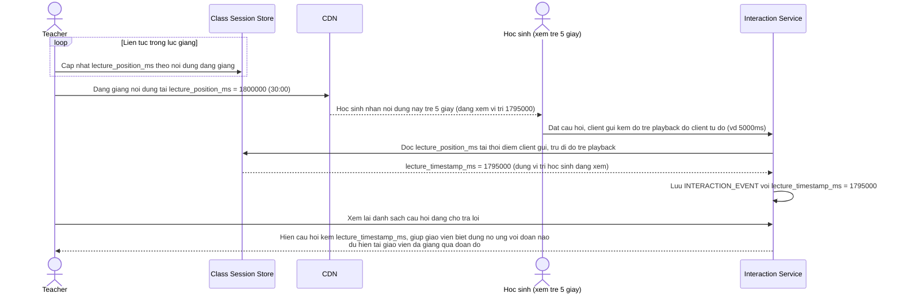

# Enhance sequence — Gắn tương tác đúng mốc nội dung bài giảng

Đây là **enhance** của flow `student-interaction` đã có ở base. So với base (gắn `client_sent_at` là giờ đồng hồ client, không phản ánh nội dung đang giảng), flow này thay đổi ở chỗ: mỗi sự kiện tương tác được gắn thêm `lecture_timestamp_ms` — tính bằng vị trí nội dung bài giảng thực tại thời điểm học sinh tương tác, sau khi bù trừ độ trễ phân phối riêng của học sinh đó — đáp ứng yêu cầu 2.

