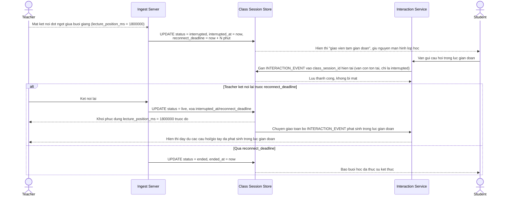

# Enhance sequence — Khôi phục đúng vị trí buổi học khi giáo viên gián đoạn

Đây là **enhance** của flow `teacher-disconnect` đã có ở base. So với base (kết thúc phiên ngay, tạo phiên mới khi kết nối lại, mất tương tác trong lúc gián đoạn), flow này thay đổi ở chỗ: phiên chuyển sang trạng thái `interrupted` kèm `reconnect_deadline`, các `INTERACTION_EVENT` gửi trong lúc gián đoạn vẫn được nhận và gắn vào đúng `class_session_id` cũ, giáo viên kết nối lại được khôi phục đúng `lecture_position_ms` mà không tạo phiên mới — đáp ứng yêu cầu 3.

