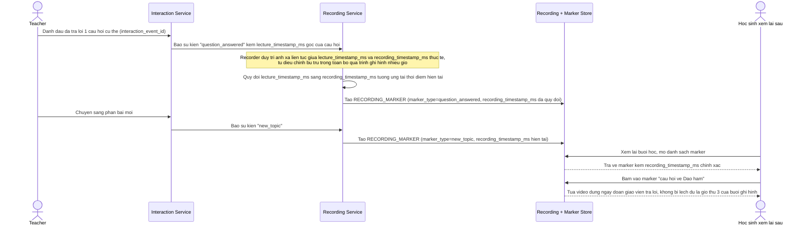

# Enhance sequence — Đồng bộ marker tương tác trong bản ghi xem lại

Đây là **enhance**, flow hoàn toàn mới so với base (base không lưu marker đồng bộ giữa video và tương tác). Đáp ứng yêu cầu 4 trong đề bài: bản ghi lại buổi học phải giữ đồng bộ chính xác giữa video bài giảng và các mốc tương tác quan trọng (câu hỏi được trả lời, chuyển phần bài mới), không bị lệch do độ trễ tích luỹ qua nhiều giờ ghi hình.

