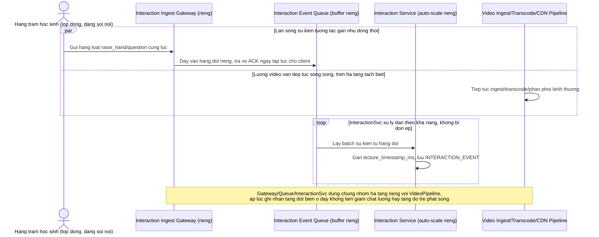

# Enhance sequence — Cách ly kênh tương tác khỏi luồng video khi lớp đông

Đây là **enhance**, flow hoàn toàn mới so với base (base xử lý tương tác chung tài nguyên với hệ thống, không có cơ chế cách ly). Đáp ứng yêu cầu 5 trong đề bài: khi lớp học lớn hàng trăm/nghìn học sinh, lượng sự kiện tương tác gửi lên gần như đồng thời không được cạnh tranh tài nguyên với luồng video chính.

