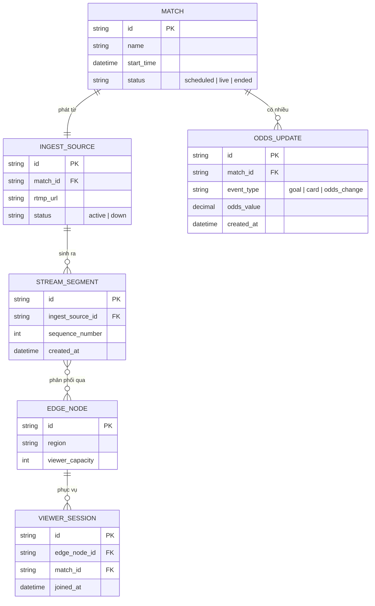

# Base ERD — Nền tảng phát sóng thể thao trước khi có yêu cầu công bằng độ trễ

Đây là **base**: mô hình dữ liệu suy luận cho một nền tảng live streaming thể thao có hiển thị tỷ lệ cá cược, ở trạng thái **trước khi** áp các yêu cầu về đồng nhất độ trễ, đồng bộ overlay, backup ingest, DVR và audit log. Base chỉ cần đủ: một nguồn ingest duy nhất, pipeline transcode/phân phối qua edge node, viewer session, và luồng cập nhật tỷ lệ cá cược độc lập với video — đủ để các yêu cầu enhance "có nghĩa" khi so sánh.

