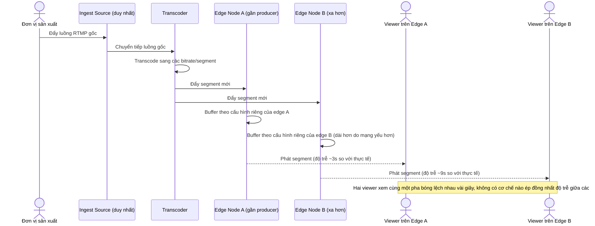

# Base sequence — Live broadcast distribution

Đây là **base**, flow "Phân phối sóng trực tiếp" ở trạng thái hiện tại: một nguồn ingest duy nhất, transcode rồi fan-out tới các edge node, mỗi edge tự buffer theo điều kiện mạng riêng. Flow này là tiền đề cho yêu cầu 1 (độ trễ đồng nhất) và yêu cầu 3 (backup ingest) vì cả hai đều tác động trực tiếp lên đúng pipeline này.

