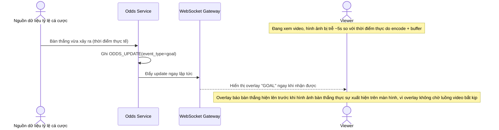

# Base sequence — Odds overlay update

Đây là **base**, flow "Cập nhật overlay tỷ lệ cá cược" ở trạng thái hiện tại: dữ liệu tỷ số/tỷ lệ cá cược được đẩy tới client độc lập hoàn toàn với pipeline video, không tham chiếu tới bất kỳ mốc thời gian nào của luồng hình ảnh. Flow này là tiền đề cho yêu cầu 2 (đồng bộ video và overlay) vì đây chính là chỗ gây ra lệch pha giữa hình ảnh và overlay.

