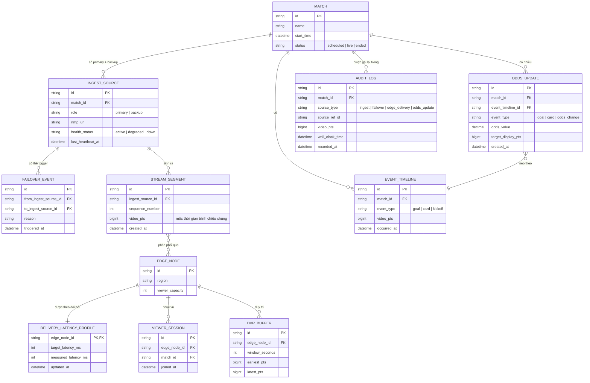

# Enhance ERD — sau khi bổ sung công bằng độ trễ, đồng bộ overlay, backup ingest, DVR và audit

Đây là ERD **sau khi** enhance được áp dụng lên base. So với base, có các entity/field mới, ứng trực tiếp với 5 yêu cầu trong đề bài:

- `INGEST_SOURCE` (sửa) — thêm `role` (primary/backup) và `health_status`, `last_heartbeat_at` để phục vụ failover (yêu cầu 3).
- `FAILOVER_EVENT` (mới) — ghi nhận mỗi lần chuyển từ ingest chính sang ingest dự phòng (yêu cầu 3).
- `STREAM_SEGMENT` (sửa) — thêm `video_pts` (mốc thời gian trình chiếu) làm trục thời gian chung cho toàn hệ thống (nền tảng cho yêu cầu 1 và 2).
- `DELIVERY_LATENCY_PROFILE` (mới) — độ trễ mục tiêu và độ trễ đo được thực tế của từng edge node, dùng để ép các edge cùng phát tại một mốc `video_pts` (yêu cầu 1).
- `EVENT_TIMELINE` (mới) — mốc `video_pts` gắn với từng sự kiện trận đấu thực tế, là điểm neo để đồng bộ overlay (yêu cầu 2).
- `ODDS_UPDATE` (sửa) — thêm `target_display_pts` để client chỉ hiển thị overlay khi player đã decode tới đúng mốc đó (yêu cầu 2).
- `DVR_BUFFER` (mới) — cửa sổ lưu tạm vài chục giây gần nhất theo từng edge, phục vụ time-shift mà không ảnh hưởng luồng chính (yêu cầu 4).
- `AUDIT_LOG` (mới) — log đầy đủ mốc thời gian của mọi sự kiện (ingest, failover, delivery, odds) để đối soát tranh chấp (yêu cầu 5).

