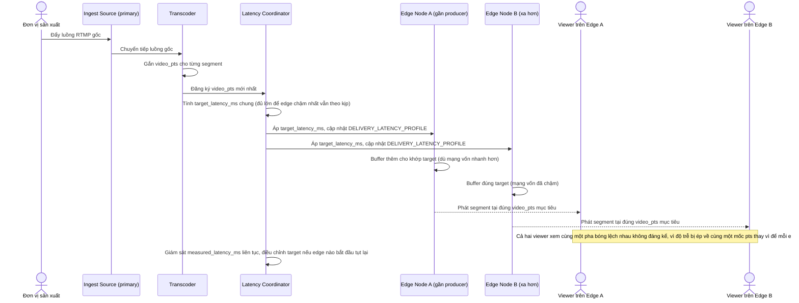

# Enhance sequence — Live broadcast distribution (độ trễ đồng nhất)

Đây là **enhance** của flow đã có ở base "Live broadcast distribution". So với base, mỗi segment nay mang `video_pts` chung và có một Latency Coordinator ép mọi edge node cùng phát tại một mốc pts mục tiêu thay vì tự buffer theo ý mình, đáp ứng **yêu cầu 1** (độ trễ đồng nhất giữa các viewer để đảm bảo công bằng cá cược).

