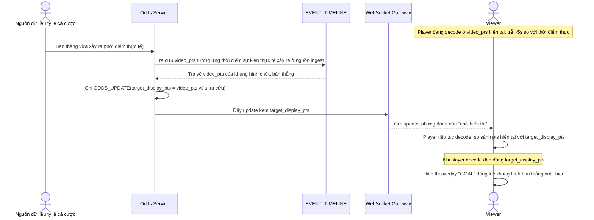

# Enhance sequence — Odds overlay update (đồng bộ với video)

Đây là **enhance** của flow đã có ở base "Odds overlay update". So với base, overlay không còn hiển thị ngay khi nhận dữ liệu, mà được neo vào `EVENT_TIMELINE.video_pts` và chỉ hiển thị khi player client đã decode tới đúng mốc `target_display_pts`, đáp ứng **yêu cầu 2** (tránh overlay hiển thị sự kiện trước khi hình ảnh thực tế diễn ra).

