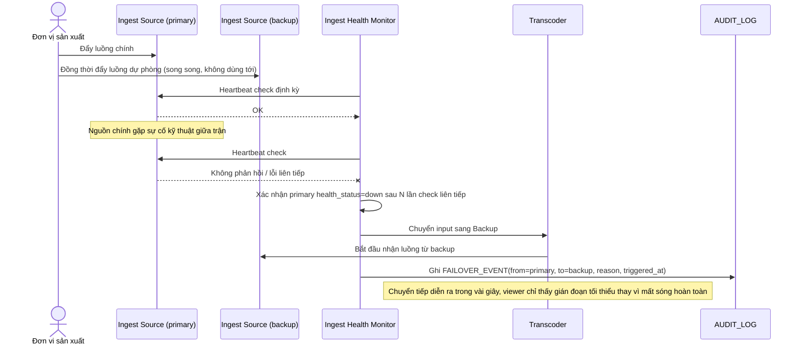

# Enhance sequence — Ingest failover

Đây là **enhance**, flow hoàn toàn mới, phát sinh từ enhance — base chỉ có một nguồn ingest duy nhất nên không có khái niệm failover. Đáp ứng **yêu cầu 3** (nguồn phát dự phòng tự động chuyển sang khi nguồn chính gặp sự cố, không mất sóng giữa trận).

