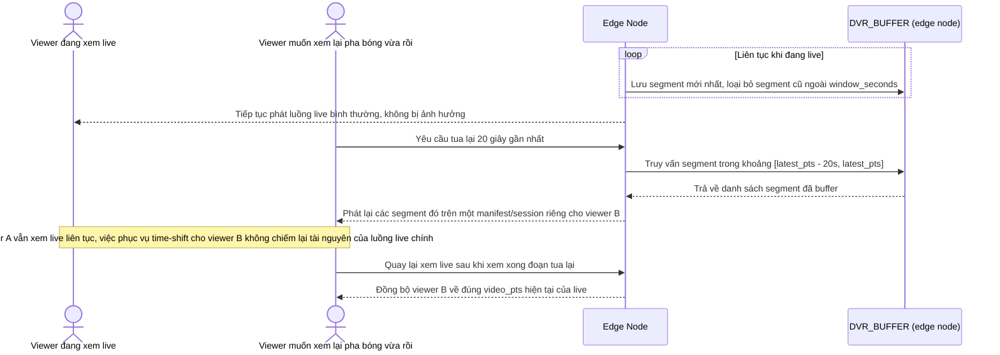

# Enhance sequence — DVR time-shift replay

Đây là **enhance**, flow hoàn toàn mới, phát sinh từ enhance — base không có cơ chế xem lại. Đáp ứng **yêu cầu 4** (hỗ trợ time-shift/DVR ngắn vài chục giây gần nhất, không ảnh hưởng luồng trực tiếp đang phân phối cho người khác).

