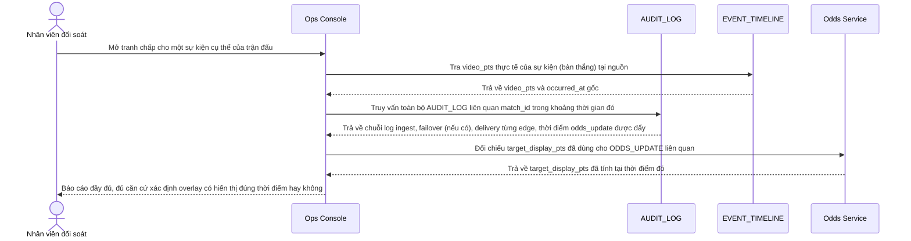

# Enhance sequence — Dispute audit lookup

Đây là **enhance**, flow hoàn toàn mới, phát sinh từ enhance — base không ghi log đối soát tập trung. Đáp ứng **yêu cầu 5** (log đầy đủ luồng và mốc thời gian sự kiện để phục vụ đối soát khi có tranh chấp về kết quả cá cược liên quan đến độ trễ hiển thị).

