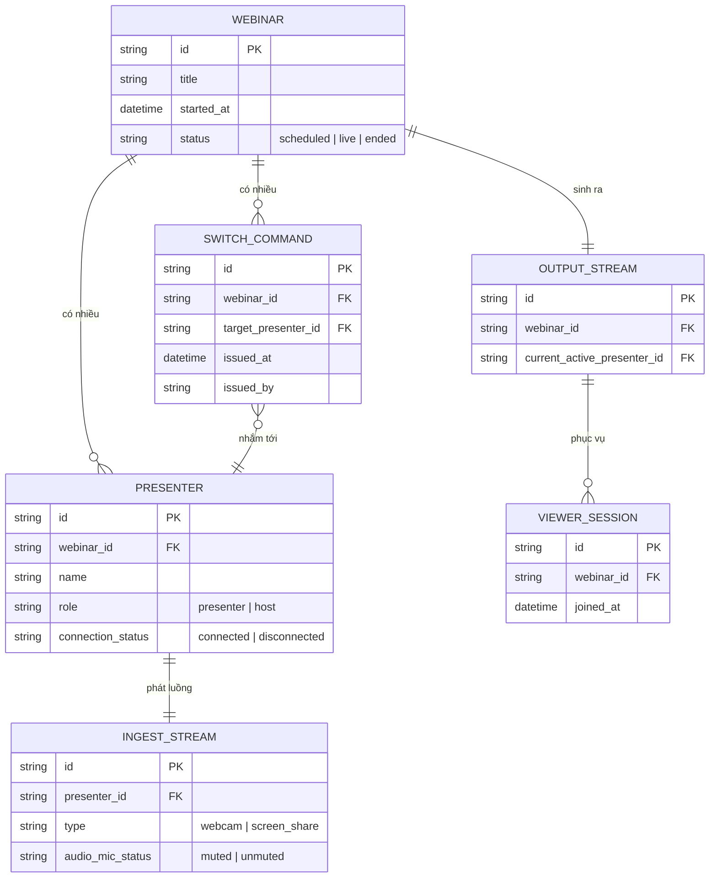

# Base ERD — Webinar nhiều presenter trước khi có bù trừ độ trễ và crossfade

Đây là **base**: mô hình dữ liệu suy luận cho một nền tảng webinar có nhiều presenter luân phiên trình bày, ở trạng thái **trước khi** áp các yêu cầu về crossfade mượt, bù trừ độ trễ mạng, failover khi rớt kết nối, ưu tiên đúng nguồn audio, và ghi lại chính xác trình tự chuyển đổi. Base chỉ cần đủ: presenter với ingest riêng, lệnh switch đơn giản do host chủ động bấm, và bản ghi output thô — đủ để các yêu cầu enhance "có nghĩa" khi so sánh.

