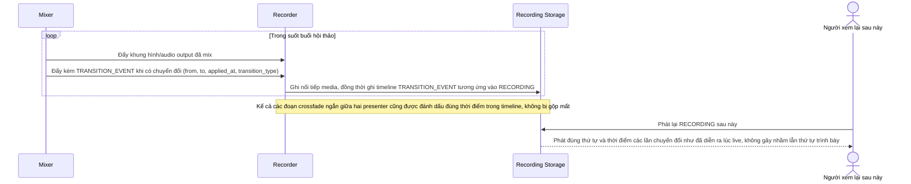

# Enhance sequence — Recording (giữ đúng trình tự chuyển đổi)

Đây là **enhance** của flow đã có ở base "Recording". So với base, recorder không chỉ ghi output thô mà còn gắn kèm toàn bộ `TRANSITION_EVENT` (bao gồm cả các khoảng crossfade ngắn) vào bản ghi, đáp ứng **yêu cầu 5** (bản ghi phải giữ đúng trình tự chuyển đổi giữa các nguồn như đã phát trực tiếp, kể cả các khoảng chuyển tiếp ngắn, để người xem lại không nhầm lẫn thứ tự trình bày).

