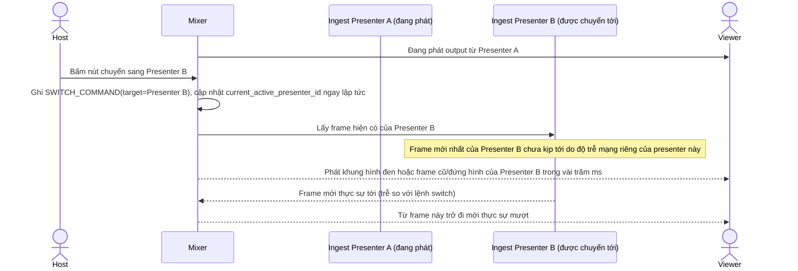

# Base sequence — Presenter switch

Đây là **base**, flow "Chuyển quyền trình bày" ở trạng thái hiện tại: host bấm switch, mixer cắt ngay sang ingest của presenter mới bất kể frame mới đã kịp tới hay chưa. Flow này là tiền đề cho **yêu cầu 1** (crossfade mượt, không đen hình/đứng hình) vì đây chính là chỗ phát sinh lỗi khi lệnh chuyển đến sớm hơn dữ liệu ingest thực tế.

