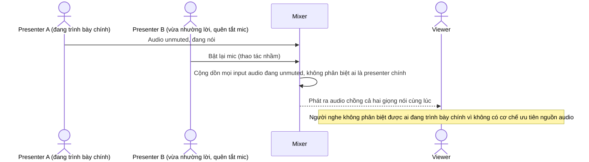

# Base sequence — Audio mixing

Đây là **base**, flow "Ghép audio" ở trạng thái hiện tại: mixer đơn giản cộng dồn audio của mọi ingest đang ở trạng thái unmuted, không có khái niệm "presenter chính đang trình bày". Flow này là tiền đề cho **yêu cầu 4** (tránh chồng tiếng khi nhiều presenter cùng bật mic nhầm) vì đây là nơi phát sinh lỗi chồng audio.

