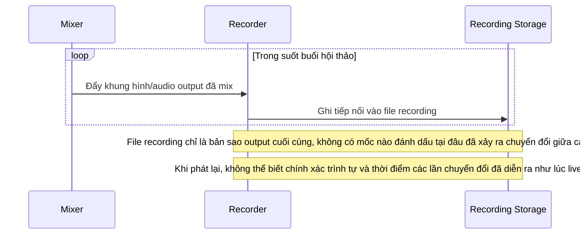

# Base sequence — Recording

Đây là **base**, flow "Ghi lại buổi hội thảo" ở trạng thái hiện tại: hệ thống chỉ ghi liên tục đúng luồng output cuối cùng đã mix, không lưu kèm bất kỳ mốc thời gian hay metadata nào về việc chuyển đổi giữa các presenter. Flow này là tiền đề cho **yêu cầu 5** (bản ghi phải giữ đúng trình tự chuyển đổi như đã phát trực tiếp) vì đây là chỗ thiếu thông tin để tái hiện chính xác trình tự khi phát lại.

