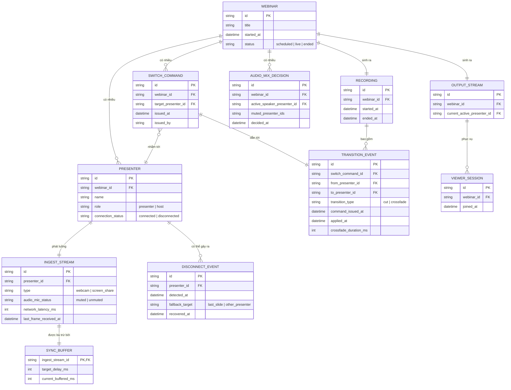

# Enhance ERD — sau khi bổ sung crossfade, bù trừ độ trễ, failover, ưu tiên audio và ghi log chuyển đổi

Đây là ERD **sau khi** enhance được áp dụng lên base. So với base, có các entity/field mới, ứng trực tiếp với 5 yêu cầu trong đề bài:

- `INGEST_STREAM` (sửa) — thêm `network_latency_ms`, `last_frame_received_at` để biết độ trễ thực tế của từng presenter (nền tảng cho yêu cầu 2).
- `SYNC_BUFFER` (mới) — bộ đệm bù trừ riêng cho từng ingest, quy về một mốc thời gian chung trước khi mixer ghép (yêu cầu 2).
- `TRANSITION_EVENT` (mới) — ghi nhận từng lần chuyển đổi thực tế giữa hai presenter, gồm thời điểm lệnh phát ra, thời điểm áp dụng thật, kiểu chuyển (cut/crossfade) — dùng để cả mixer chờ đúng thời điểm chuyển mượt (yêu cầu 1) lẫn phục vụ ghi lại đúng trình tự khi phát lại (yêu cầu 5).
- `DISCONNECT_EVENT` (mới) — phát hiện presenter rớt kết nối và nguồn được chuyển sang thay thế (yêu cầu 3).
- `AUDIO_MIX_DECISION` (mới) — mỗi thời điểm chỉ có một presenter được coi là nguồn audio chính, các nguồn khác bị mute dù đang bật mic (yêu cầu 4).
- `RECORDING` (mới) — bản ghi chính thức, liên kết với toàn bộ `TRANSITION_EVENT` để tái hiện đúng trình tự khi phát lại (yêu cầu 5).

