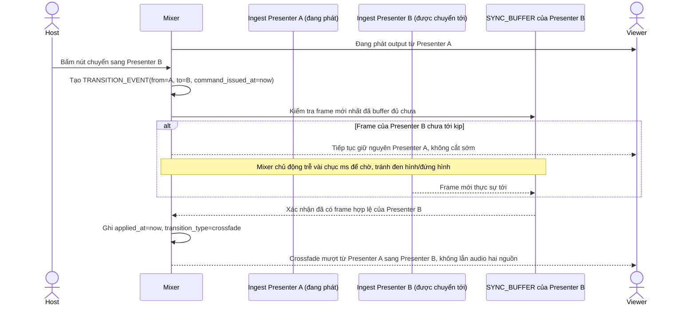

# Enhance sequence — Presenter switch (crossfade mượt)

Đây là **enhance** của flow đã có ở base "Presenter switch". So với base, mixer không cắt ngay khi nhận lệnh switch, mà tạo một `TRANSITION_EVENT`, chờ frame của presenter mới thực sự tới (dựa trên `SYNC_BUFFER`) rồi mới crossfade, đáp ứng **yêu cầu 1** (không đen hình/đứng hình/lẫn audio do lệch thời điểm giữa lệnh chuyển và ingest thực tế).

