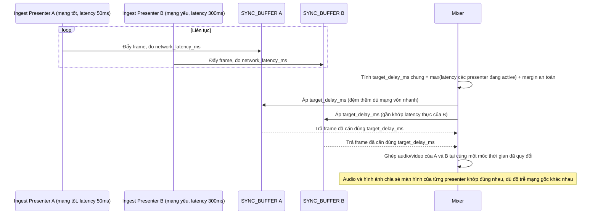

# Enhance sequence — Ingest sync compensation

Đây là **enhance**, flow hoàn toàn mới, phát sinh từ enhance — base không có cơ chế bù trừ độ trễ giữa các presenter. Đáp ứng **yêu cầu 2** (mỗi luồng ingest có độ trễ mạng khác nhau, hệ thống mixing phải bù trừ lệch thời gian trước khi ghép, tránh audio một presenter không khớp hành động màn hình đang hiển thị).

