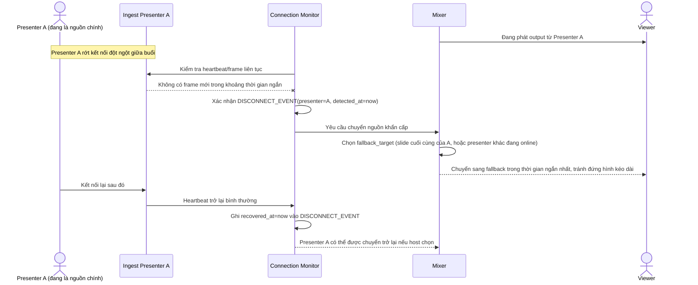

# Enhance sequence — Presenter disconnect failover

Đây là **enhance**, flow hoàn toàn mới, phát sinh từ enhance — base không có cơ chế phát hiện/khắc phục khi presenter đang live bị rớt kết nối. Đáp ứng **yêu cầu 3** (tự động phát hiện và chuyển output sang nguồn còn sống trong thời gian ngắn nhất khi presenter chính đang phát bị rớt kết nối).

