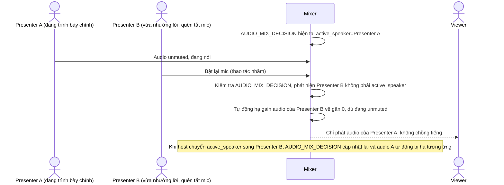

# Enhance sequence — Audio mixing (ưu tiên đúng nguồn)

Đây là **enhance** của flow đã có ở base "Audio mixing". So với base, mixer không còn cộng dồn mọi nguồn unmuted, mà dựa vào `AUDIO_MIX_DECISION` để xác định đúng một presenter là nguồn audio chính tại mỗi thời điểm, các nguồn khác tự động bị hạ mức dù đang bật mic, đáp ứng **yêu cầu 4** (tránh chồng tiếng khi nhiều presenter cùng bật mic nhầm).

