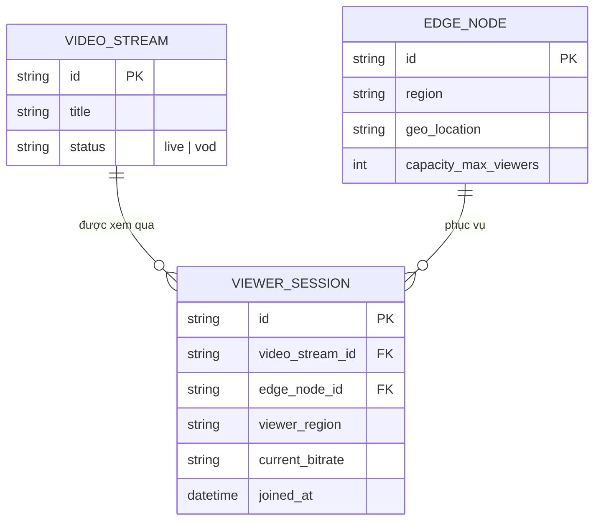

# Base ERD — CDN video streaming trước khi có load balancing thông minh ở edge

Đây là **base**: mô hình dữ liệu suy luận cho một CDN phục vụ video streaming, ở trạng thái **trước khi** áp các yêu cầu về chọn node theo tải, giảm tải có kiểm soát, di chuyển viewer êm, xử lý race condition số liệu tải, và phát hiện suy giảm chất lượng ngầm. Base chỉ cần đủ: edge node theo khu vực địa lý và viewer session gắn cứng vào một edge node theo quy tắc gần nhất đơn thuần — đủ để các yêu cầu enhance "có nghĩa" khi so sánh.

