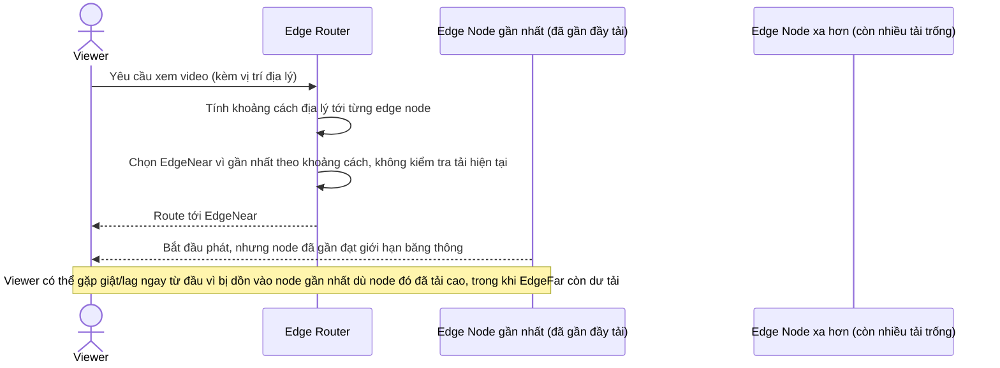

# Base sequence — Edge node selection

Đây là **base**, flow "Chọn edge node cho viewer mới" ở trạng thái hiện tại: chỉ dựa vào khoảng cách địa lý đơn thuần, không xét tới tải hiện tại của node. Flow này là tiền đề cho **yêu cầu 1** (kết hợp cả địa lý lẫn tải hiện tại) vì đây chính là logic sẽ được thay đổi.

