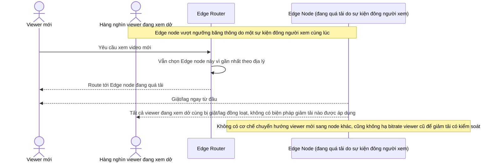

# Base sequence — Edge overload handling

Đây là **base**, flow "Xử lý khi edge node quá tải" ở trạng thái hiện tại: khi một edge node vượt ngưỡng tải giữa lúc đang phục vụ hàng nghìn viewer, hệ thống không có phản ứng nào — cả viewer mới lẫn viewer cũ đều tiếp tục dồn vào node đó. Flow này là tiền đề cho **yêu cầu 2** (giảm tải có kiểm soát) và **yêu cầu 3** (di chuyển viewer êm) vì đây là tình huống cả hai yêu cầu đó nhắm tới xử lý.

