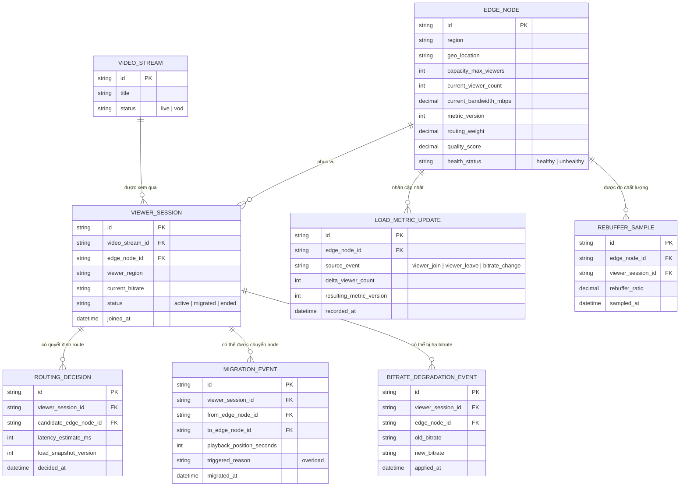

# Enhance ERD — sau khi bổ sung load-aware routing, giảm tải có kiểm soát, migration êm, chống race condition và phát hiện suy giảm chất lượng

Đây là ERD **sau khi** enhance được áp dụng lên base. So với base, có các entity/field mới, ứng trực tiếp với 5 yêu cầu trong đề bài:

- `EDGE_NODE` (sửa) — thêm `current_viewer_count`, `current_bandwidth_mbps`, `metric_version` (đọc số liệu tải có phiên bản để tránh stale read), `routing_weight` và `quality_score` (yêu cầu 1, 4, 5).
- `LOAD_METRIC_UPDATE` (mới) — mọi lần cập nhật số liệu tải (viewer join/leave/đổi bitrate) được ghi thành sự kiện có `metric_version` tăng dần, dùng cập nhật atomic thay vì đọc-sửa-ghi trực tiếp (yêu cầu 4).
- `ROUTING_DECISION` (mới) — mỗi lần route viewer mới ghi lại `load_snapshot_version` đã dùng, để truy vết và đảm bảo quyết định dựa trên số liệu đủ mới (yêu cầu 1, 4).
- `MIGRATION_EVENT` (mới) — ghi lại việc chuyển một viewer đang xem dở từ edge quá tải sang edge khác kèm `playback_position_seconds` để nối tiếp không gián đoạn (yêu cầu 3).
- `BITRATE_DEGRADATION_EVENT` (mới) — ghi lại việc hạ bitrate có kiểm soát cho một phần viewer trên node quá tải thay vì để tất cả cùng giật (yêu cầu 2).
- `REBUFFER_SAMPLE` (mới) — mẫu tỉ lệ rebuffer từng viewer trên từng edge node, dùng phát hiện suy giảm chất lượng dù node vẫn "healthy" theo health check cơ bản (yêu cầu 5).

