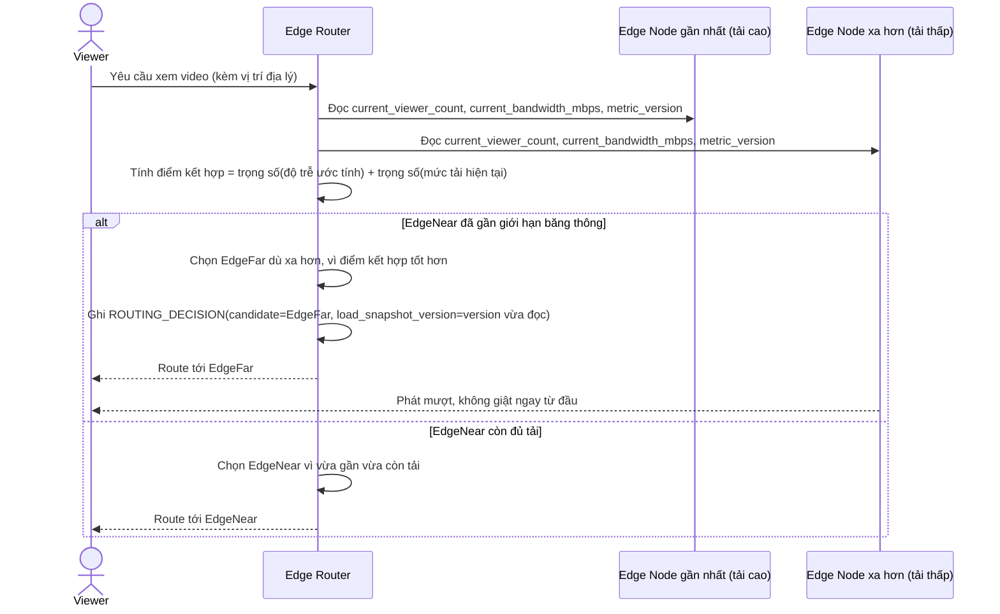

# Enhance sequence — Edge node selection (kết hợp địa lý và tải)

Đây là **enhance** của flow đã có ở base "Edge node selection". So với base, router không chỉ xét khoảng cách địa lý mà còn đọc `current_viewer_count`/`current_bandwidth_mbps` kèm `metric_version` mới nhất của từng ứng viên trước khi quyết định, đáp ứng **yêu cầu 1** (kết hợp cả yếu tố địa lý lẫn tải hiện tại, không chỉ chọn node gần nhất nếu node đó đã gần đạt giới hạn băng thông).

