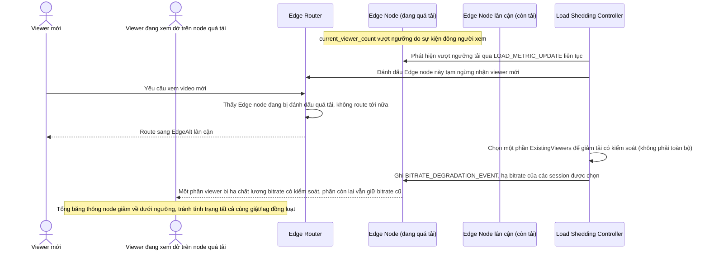

# Enhance sequence — Edge overload handling (giảm tải có kiểm soát)

Đây là **enhance** của flow đã có ở base "Edge overload handling". So với base, khi node vượt ngưỡng tải, viewer mới bị chuyển hướng ngay sang node lân cận, còn viewer đang xem dở được hạ bitrate có chọn lọc thay vì để tất cả cùng giật, đáp ứng **yêu cầu 2** (chuyển hướng viewer mới sang node khác, chiến lược giảm tải có kiểm soát cho viewer đang xem dở).

