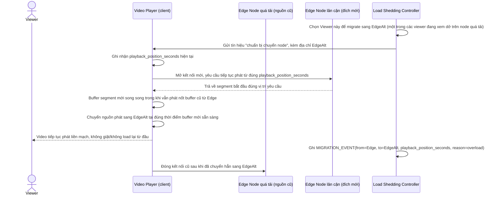

# Enhance sequence — Seamless viewer migration

Đây là **enhance**, flow hoàn toàn mới, phát sinh từ enhance — base không có cơ chế di chuyển viewer giữa các edge node. Đáp ứng **yêu cầu 3** (chuyển viewer từ edge quá tải sang node khác giữa lúc đang phát mà không làm gián đoạn luồng người dùng nhận biết được, tương tự đổi kênh CDN chứ không phải ngắt và load lại từ đầu).

