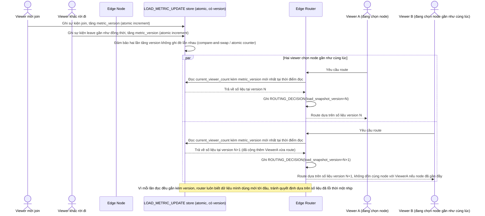

# Enhance sequence — Load metric race condition handling

Đây là **enhance**, flow hoàn toàn mới, phát sinh từ enhance — base không có khái niệm cập nhật tải với kiểm soát đồng thời. Đáp ứng **yêu cầu 4** (nhiều nguồn cập nhật số liệu tải gần như đồng thời, quyết định route phải dựa trên số liệu đủ mới, tránh dồn nhiều viewer mới vào cùng một node vì đọc phải số liệu đã lỗi thời).

