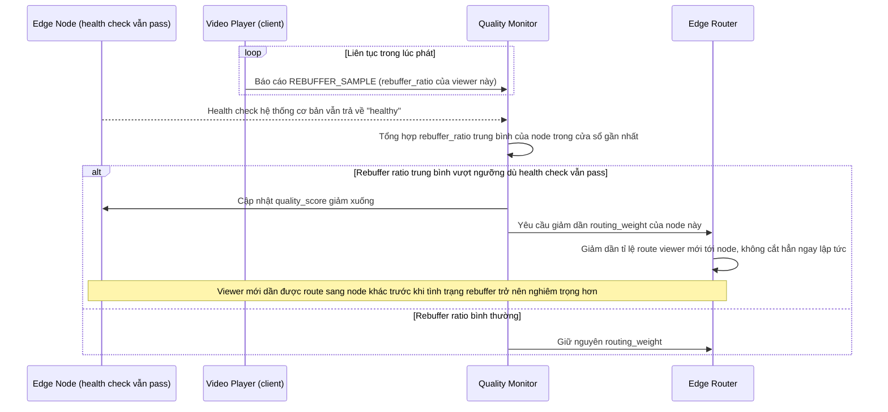

# Enhance sequence — Edge quality degradation detection

Đây là **enhance**, flow hoàn toàn mới, phát sinh từ enhance — base chỉ dựa vào health check hệ thống cơ bản, không có khái niệm chất lượng dịch vụ thực tế. Đáp ứng **yêu cầu 5** (phát hiện edge node suy giảm chất lượng dù vẫn "healthy" theo health check cơ bản, ví dụ tỉ lệ rebuffer tăng cao, và giảm dần trọng số route trước khi tình trạng nghiêm trọng hơn).

