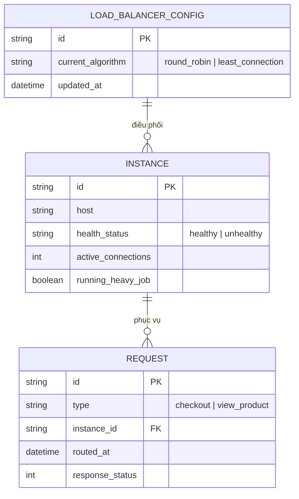

# Base ERD — Load balancer checkout trước khi có outlier detection, shedding, pool tách biệt và circuit breaker

Đây là **base**: mô hình dữ liệu suy luận cho load balancer đứng trước checkout service của một sàn e-commerce, ở trạng thái **trước khi** áp các yêu cầu về outlier detection, shed load, tách pool theo loại traffic, chống race condition đếm tải, và circuit breaker phối hợp. Base chỉ cần đủ: cấu hình LB có thể tự chuyển giữa round-robin và least-connection (đúng như mô tả vai trò hiện tại của flow), một pool instance duy nhất phục vụ mọi loại request, và health check nhị phân đơn giản — đủ để các yêu cầu enhance "có nghĩa" khi so sánh.

