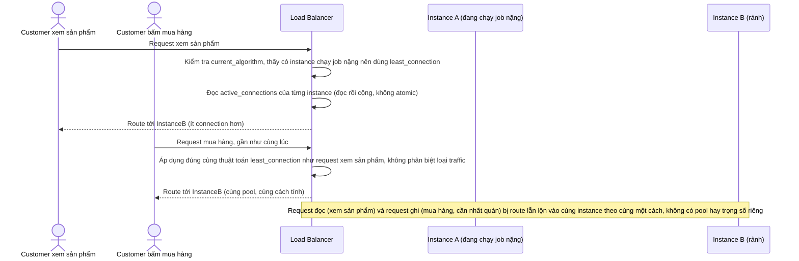

# Base sequence — Request routing

Đây là **base**, flow "Định tuyến request" ở trạng thái hiện tại: LB tự chuyển giữa round-robin (bình thường) và least-connection (khi có instance đang chạy job nặng), nhưng đối xử với mọi loại request (xem sản phẩm lẫn mua hàng) hoàn toàn như nhau, và đọc/ghi `active_connections` một cách đơn giản không đảm bảo atomic. Flow này là tiền đề cho **yêu cầu 3** (tách pool/trọng số theo loại traffic) và **yêu cầu 4** (race condition khi cập nhật bộ đếm tải) vì cả hai đều tác động trực tiếp lên đúng bước ra quyết định này.

