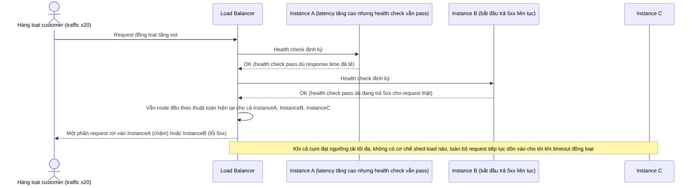

# Base sequence — Traffic spike handling

Đây là **base**, flow "Xử lý khi traffic tăng đột biến" ở trạng thái hiện tại: khi flash sale khiến traffic tăng 20 lần, LB tiếp tục route mọi request như bình thường, không có outlier detection, không shed load, không circuit breaker — cả cụm bị dồn tải tới khi sập. Flow này là tiền đề cho **yêu cầu 1** (outlier detection), **yêu cầu 2** (shed load có kiểm soát) và **yêu cầu 5** (circuit breaker) vì cả ba đều nhằm xử lý đúng tình huống này.

