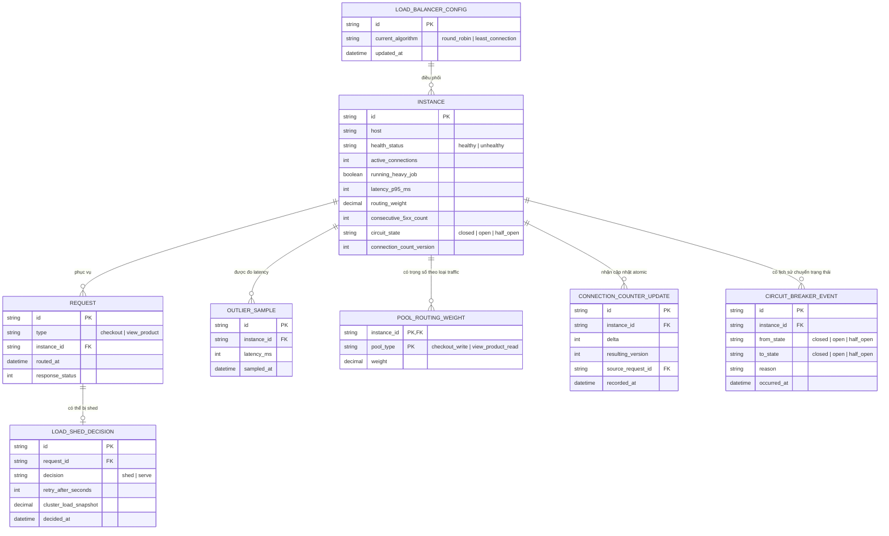

# Enhance ERD — sau khi bổ sung outlier detection, load shedding, tách pool, chống race condition và circuit breaker

Đây là ERD **sau khi** enhance được áp dụng lên base. So với base, có các entity/field mới, ứng trực tiếp với 5 yêu cầu trong đề bài:

- `INSTANCE` (sửa) — thêm `latency_p95_ms`, `routing_weight`, `consecutive_5xx_count`, `circuit_state`, `connection_count_version` (yêu cầu 1, 4, 5).
- `OUTLIER_SAMPLE` (mới) — mẫu latency đo định kỳ từng instance, dùng phát hiện instance chậm dù health check vẫn pass (yêu cầu 1).
- `POOL_ROUTING_WEIGHT` (mới) — trọng số route riêng theo từng loại traffic (buy/view) cho từng instance, tách biệt cách đối xử giữa request đọc và ghi (yêu cầu 3).
- `LOAD_SHED_DECISION` (mới) — ghi nhận quyết định shed load (trả 503 kèm Retry-After) khi cả cụm đạt ngưỡng tải, thay vì để tất cả cùng timeout (yêu cầu 2).
- `CONNECTION_COUNTER_UPDATE` (mới) — log mọi lần cập nhật `active_connections`, dùng `resulting_version` để đảm bảo cập nhật atomic, tránh race condition (yêu cầu 4).
- `CIRCUIT_BREAKER_EVENT` (mới) — ghi lại mỗi lần instance bị loại khỏi vòng quay do liên tục lỗi 5xx và các lần thử lại half-open (yêu cầu 5).

