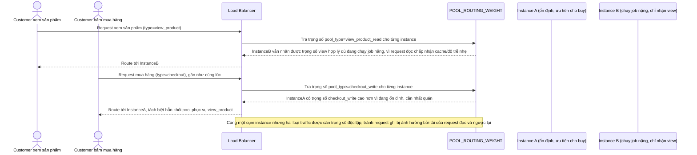

# Enhance sequence — Request routing (tách pool theo loại traffic)

Đây là **enhance** của flow đã có ở base "Request routing". So với base, LB tra `POOL_ROUTING_WEIGHT` để đối xử khác nhau giữa request đọc (xem sản phẩm, có thể cache, ưu tiên rải đều/ít quan tâm nhất quán) và request ghi (mua hàng, cần nhất quán, ưu tiên instance ổn định), đáp ứng **yêu cầu 3** (không route request "mua hàng" và "xem sản phẩm" theo cùng một cách).

