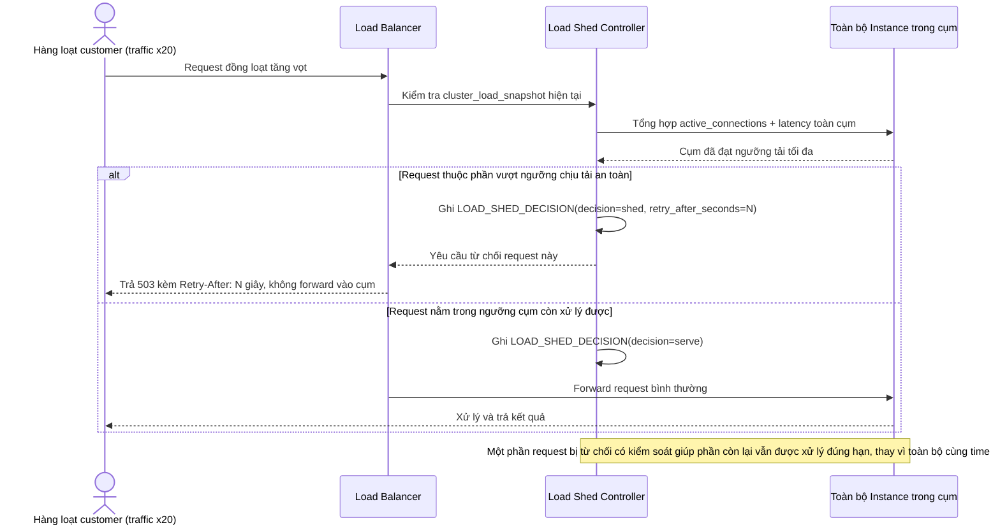

# Enhance sequence — Traffic spike handling (shed load có kiểm soát)

Đây là **enhance** của flow đã có ở base "Traffic spike handling". So với base, khi toàn cụm đạt ngưỡng tải tối đa, LB chủ động trả lỗi 503 kèm `Retry-After` cho một phần request thay vì để tất cả cùng dồn vào và timeout đồng loạt, đáp ứng **yêu cầu 2** (cơ chế shed load có kiểm soát khi cluster đạt ngưỡng tải tối đa).

