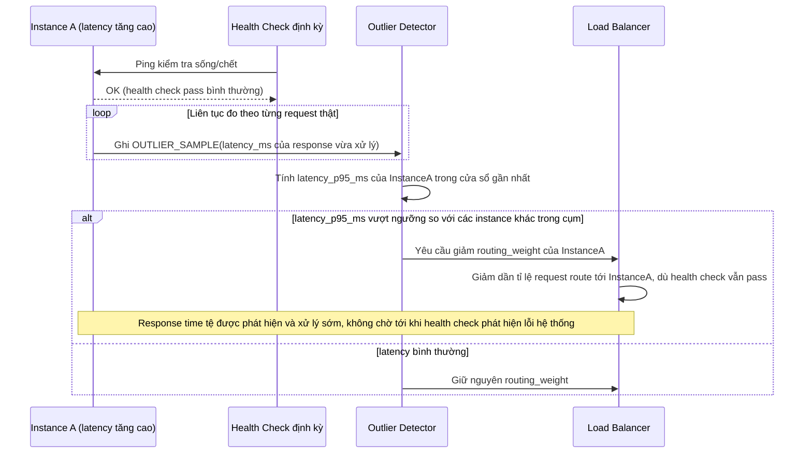

# Enhance sequence — Outlier detection

Đây là **enhance**, flow hoàn toàn mới, phát sinh từ enhance — base chỉ có health check nhị phân, không phát hiện được instance chậm. Đáp ứng **yêu cầu 1** (phát hiện instance "chậm" dù vẫn healthy theo health check thông thường, giảm trọng số route tới instance đó).

