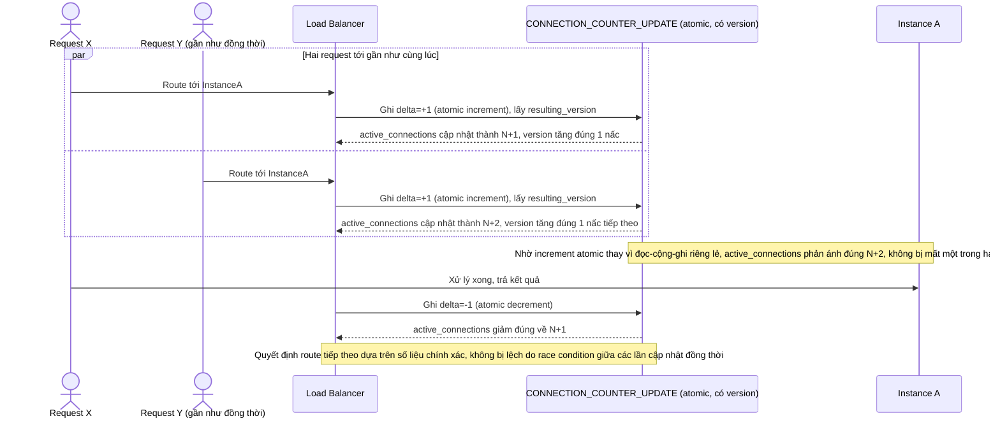

# Enhance sequence — Connection counter race condition

Đây là **enhance**, flow hoàn toàn mới, phát sinh từ enhance — base đọc/ghi `active_connections` một cách đơn giản không đảm bảo atomic. Đáp ứng **yêu cầu 4** (nhiều request cùng cập nhật bộ đếm connection/tải của một instance đồng thời, đảm bảo số liệu dùng để ra quyết định route không bị lệch do cập nhật không atomic).

