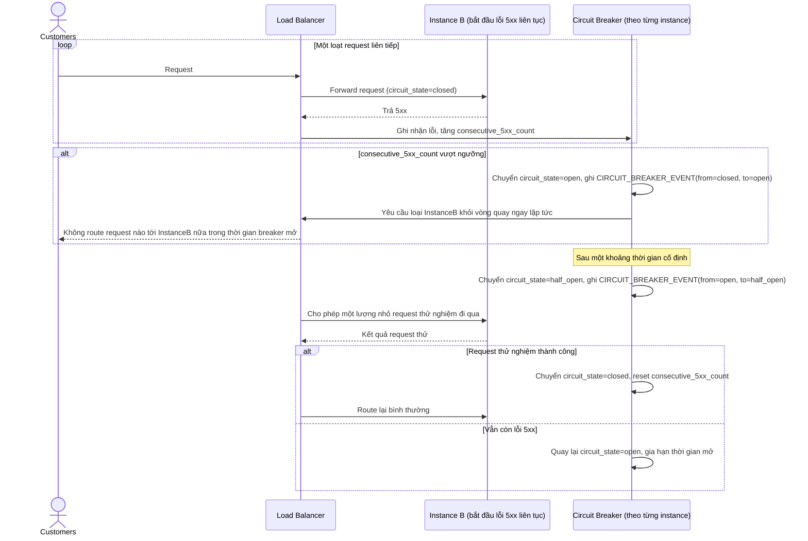

# Enhance sequence — Circuit breaker phối hợp với LB

Đây là **enhance**, flow hoàn toàn mới, phát sinh từ enhance — base chỉ dựa vào health check thủ công để loại instance lỗi. Đáp ứng **yêu cầu 5** (circuit breaker phối hợp với LB: instance liên tục trả lỗi 5xx tự động bị loại khỏi vòng quay trong một khoảng thời gian rồi thử lại dần qua half-open, không chờ health check thủ công).

