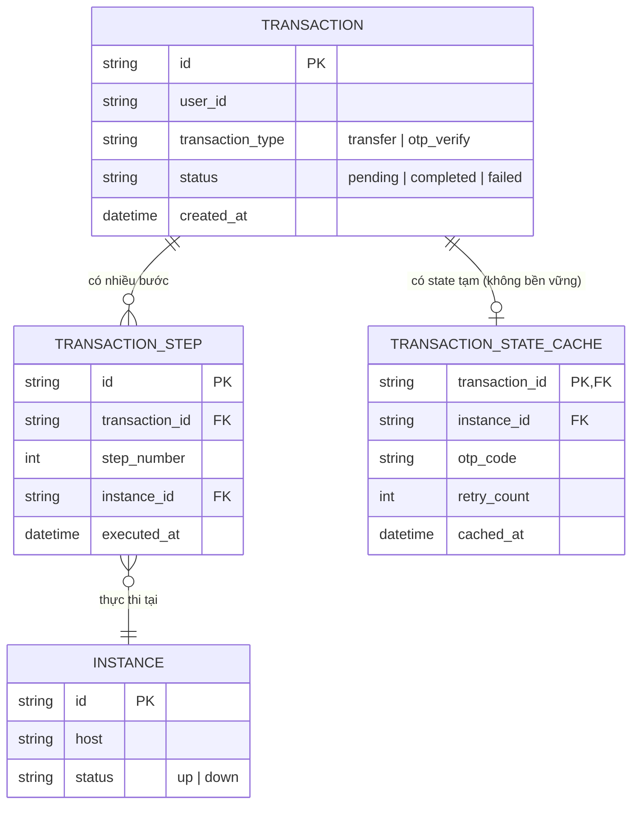

# Base ERD — LB thanh toán trước khi có consistent hashing

Đây là **base**: mô hình dữ liệu suy luận cho load balancer đứng trước service xử lý giao dịch chuyển tiền nhiều bước, ở trạng thái **trước khi** áp consistent hashing. Base chỉ cần đủ: giao dịch nhiều bước được route round-robin không đảm bảo cùng instance, và mỗi instance có thể tạm giữ state trong bộ nhớ (không bền vững, dễ mất) để xử lý OTP nhiều bước — đủ để yêu cầu enhance "có nghĩa" khi so sánh.

