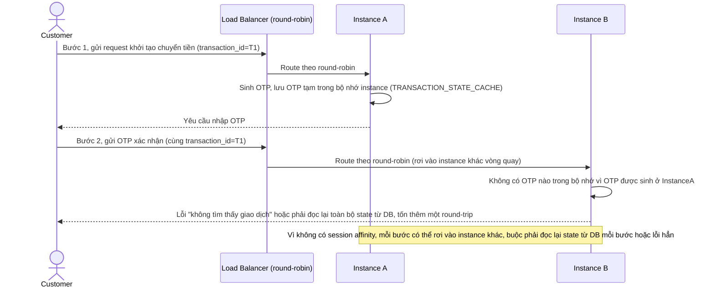

# Base sequence — Multi-step transaction (OTP)

Đây là **base**, flow "Giao dịch nhiều bước" ở trạng thái hiện tại: mỗi bước của cùng một giao dịch được LB route round-robin độc lập, không có gì đảm bảo hai bước liên tiếp rơi vào cùng instance. Flow này là tiền đề cho **yêu cầu 1** (consistent hashing đảm bảo cùng transaction_id luôn map tới cùng instance) vì đây chính là lỗ hổng mà consistent hashing sẽ khắc phục.

