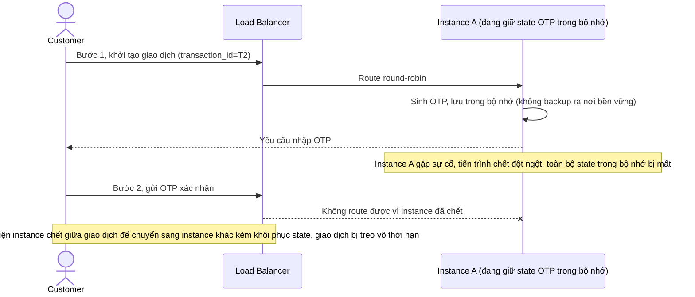

# Base sequence — Instance failure handling

Đây là **base**, flow "Xử lý khi instance chết giữa giao dịch" ở trạng thái hiện tại: khi instance đang giữ state trong bộ nhớ chết đột ngột, không có cơ chế phát hiện hay khôi phục nào, giao dịch bị treo. Flow này là tiền đề cho **yêu cầu 2** (phát hiện và fail-over kèm khôi phục state từ nguồn bền) vì đây chính là hậu quả cần khắc phục.

