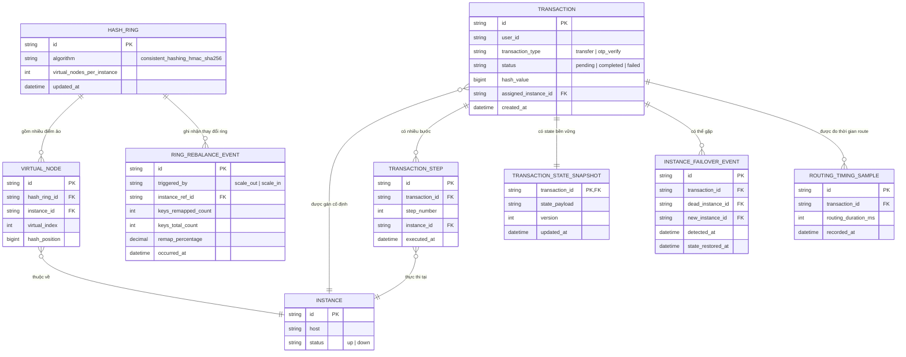

# Enhance ERD — sau khi có consistent hashing, virtual node, failover và chống timing attack

Đây là ERD **sau khi** enhance được áp dụng lên base. So với base, có các entity/field mới, ứng trực tiếp với 5 yêu cầu trong đề bài:

- `HASH_RING` + `VIRTUAL_NODE` (mới) — vòng hash với nhiều điểm ảo cho mỗi instance, tránh phân bố lệch tải khi cluster nhỏ (yêu cầu 1, 4).
- `TRANSACTION` (sửa) — thêm `hash_value`, `assigned_instance_id` để cùng `transaction_id` luôn map về đúng một instance trong suốt vòng đời giao dịch (yêu cầu 1).
- `TRANSACTION_STATE_SNAPSHOT` (mới) — state được ghi bền vững (DB/cache) sau mỗi bước thay vì chỉ giữ trong bộ nhớ, làm nguồn khôi phục khi failover (yêu cầu 2).
- `INSTANCE_FAILOVER_EVENT` (mới) — ghi nhận việc phát hiện instance chết giữa giao dịch và chuyển sang instance khác kèm khôi phục state (yêu cầu 2).
- `RING_REBALANCE_EVENT` (mới) — ghi nhận mỗi lần thêm/bớt instance khỏi ring, kèm số liệu % key bị remap để verify đặc tính consistent hashing (yêu cầu 3).
- `ROUTING_TIMING_SAMPLE` (mới) — đo thời gian route của từng request để đảm bảo không có sự khác biệt đáng kể giữa các user, tránh lộ thông tin qua timing attack (yêu cầu 5).

