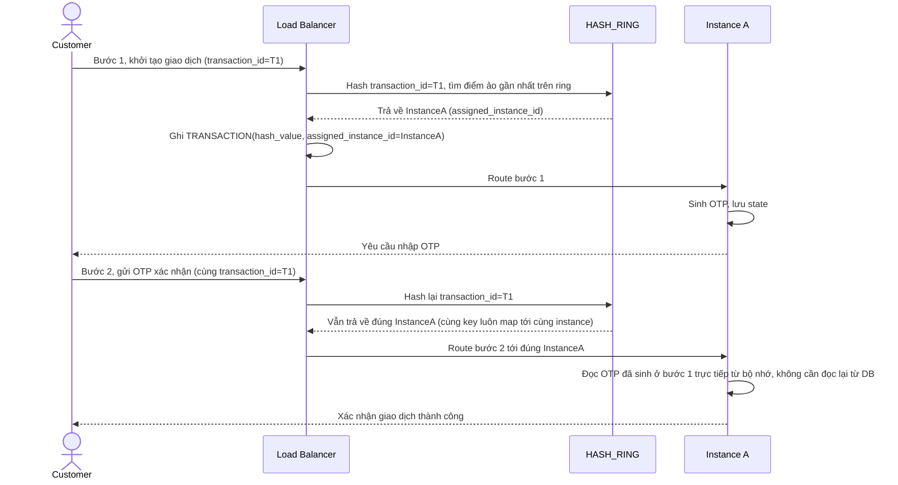

# Enhance sequence — Multi-step transaction (consistent hashing)

Đây là **enhance** của flow đã có ở base "Multi-step transaction (OTP)". So với base, LB không còn round-robin từng bước độc lập, mà hash `transaction_id` lên `HASH_RING` để chọn đúng một instance cố định cho toàn bộ vòng đời giao dịch, đáp ứng **yêu cầu 1** (implement consistent hashing ring, hash key là transaction_id, đảm bảo cùng key luôn map tới cùng instance trong suốt vòng đời giao dịch).

