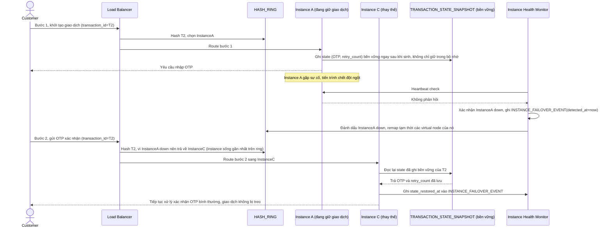

# Enhance sequence — Instance failure handling (failover + khôi phục state)

Đây là **enhance** của flow đã có ở base "Instance failure handling". So với base, state được ghi bền vững vào `TRANSACTION_STATE_SNAPSHOT` sau mỗi bước, và khi instance đang giữ giao dịch chết, LB phát hiện, remap ring, chuyển request tiếp theo sang instance khác kèm khôi phục state, đáp ứng **yêu cầu 2** (phát hiện instance chết giữa giao dịch, fail-over kèm khôi phục state từ nguồn bền, không để giao dịch treo vô thời hạn).

