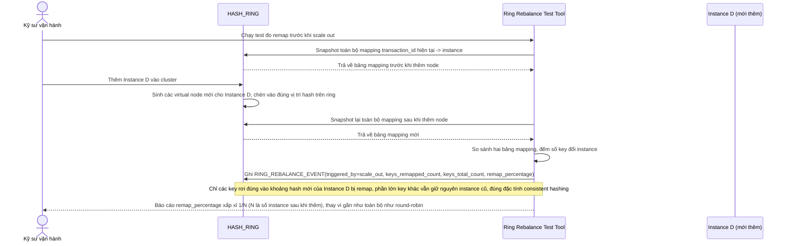

# Enhance sequence — Ring rebalance khi scale in/out

Đây là **enhance**, flow hoàn toàn mới, phát sinh từ enhance — base dùng round-robin nên không có khái niệm "ring" hay remap. Đáp ứng **yêu cầu 3** (khi thêm/bớt instance khỏi ring, số lượng key phải bị remap là tối thiểu, verify bằng test đo tỉ lệ % key bị đổi instance trước/sau khi thêm 1 node).

