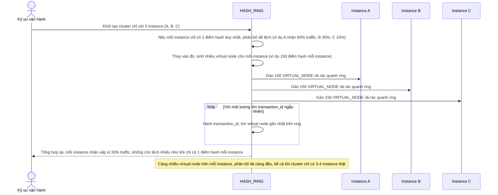

# Enhance sequence — Virtual node distribution

Đây là **enhance**, flow hoàn toàn mới, phát sinh từ enhance — base không có ring nên không có khái niệm virtual node. Đáp ứng **yêu cầu 4** (cơ chế virtual node, nhiều điểm hash cho một instance, tránh phân bố lệch tải khi cluster nhỏ, ví dụ chỉ 3-4 instance).

