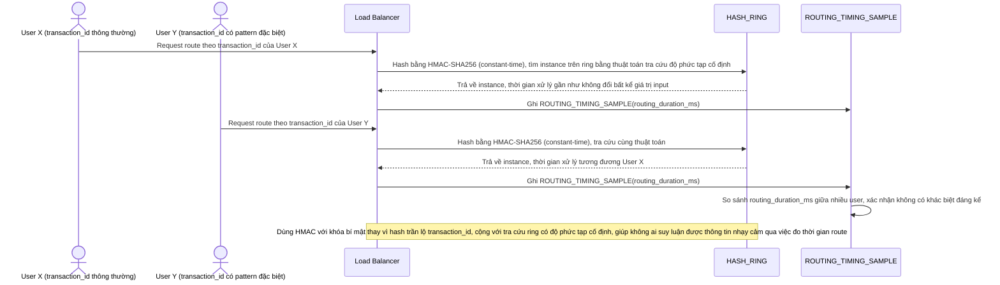

# Enhance sequence — Constant-time hash routing

Đây là **enhance**, flow hoàn toàn mới, phát sinh từ enhance — base không có bước hash nào nên không phát sinh rủi ro timing attack. Đáp ứng **yêu cầu 5** (đảm bảo hash key không lộ thông tin nhạy cảm qua timing attack, thời gian route không được khác biệt đáng kể giữa các user).

